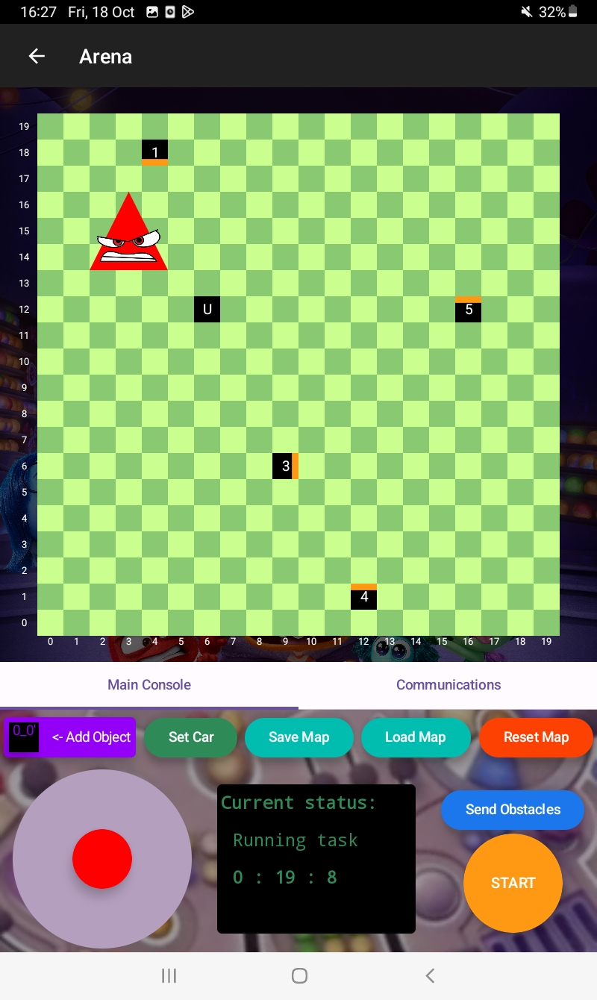

# NTU Multidisciplinary Design Project (Android)

This repository contains the Android application for the NTU Multidisciplinary Design Project (MDP), where the goal is to build a functional robotic system that integrates both software and hardware components to perform tasks such as pathfinding and image recognition. The Android application interfaces with the robot with Bluetooth Classic protocol to perform tasks such as pathfinding and image recognition.

## Key Features

- **Bluetooth Classic Communication**: For communicating with the STM32. Users can select the Bluetooth connection to pair in the Bluetooth menu.
- **Map setting**: Using intuitive drag and drop functionality, users can insert obstacles into the map and determine their facing.
- **Real-Time Control**: Manually control the robot through a joystick interface for specific tasks.
- **Real-Time Feedback**: The application continuously receives feedback from the robot, including data on its current position, time elapsed, pathfinding status, and image recognition results, all of which are displayed on the Android interface.

## Images

=
## Technologies Used

- **Android SDK**: The app is built using **Android Studio** and the native **Android SDK**, providing a responsive and efficient user interface.
- **Bluetooth Classic**: To establish a stable and reliable connection between the mobile device and the robot.
- **Java/Kotlin**: The Android application is developed using **Java** and/or **Kotlin** for the underlying logic and communication protocols.
- **Jetpack Compose**: A Kotlin framework to build most of the UI.
